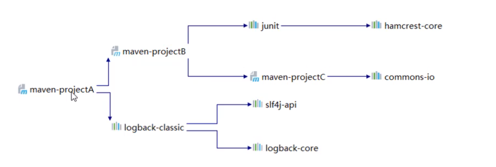
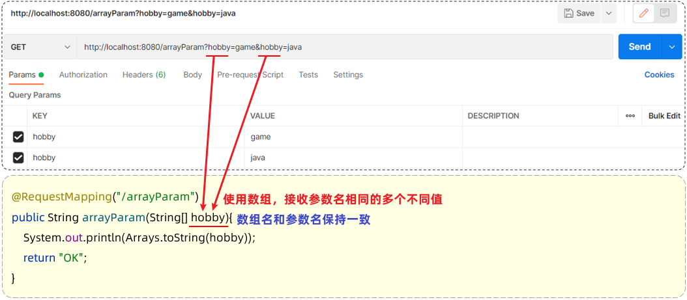

[TOC]


# 后端

## Maven

Why Maven?

* 依赖管理
* 统一项目结构（Eclipse/IDEA），生成的目录结构相同
* 标准**跨平台**的自动化项目构建

POM项目对象模型


> 其实是由插件完成生命周期的各个操作。

*IDEA集成Maven*

坐标：


### 依赖管理

特性：依赖传递




> `<exclusion>` 来排除依赖。

依赖范围


生命周期


> install实际上打包为 jar 包。

## Web

### HTTP

> 请求路径前自动加上的协议。


> 通过Web会话技术解决多次请求间不能共享数据。

#### 请求协议


#### 响应协议


一、状态码大类

| 状态码分类 | 说明                                                         |
| ---------- | ------------------------------------------------------------ |
| 1xx        | **响应中**——临时状态码，表示请求已经接受，告诉客户端应该继续请求或者如果它已经完成则忽略它 |
| 2xx        | **成功**——表示请求已经被成功接收，处理已完成                 |
| 3xx        | **重定向**——重定向到其它地方：它让客户端再发起一个请求以完成整个处理。 |
| 4xx        | **客户端错误**——处理发生错误，责任在客户端，如：客户端的请求一个不存在的资源，客户端未被授权，禁止访问等 |
| 5xx        | **服务器端错误**——处理发生错误，责任在服务端，如：服务端抛出异常，路由出错，HTTP版本不支持等 |

二、常见的响应状态码

| 状态码  | 英文描述                               | 解释                                                         |
| ------- | -------------------------------------- | ------------------------------------------------------------ |
| ==200== | **`OK`**                               | 客户端请求成功，即**处理成功**，这是我们最想看到的状态码     |
| 302     | **`Found`**                            | 指示所请求的资源已移动到由`Location`响应头给定的 URL，浏览器会自动重新访问到这个页面 |
| 304     | **`Not Modified`**                     | 告诉客户端，你请求的资源至上次取得后，服务端并未更改，你直接用你本地缓存吧。隐式重定向 |
| 400     | **`Bad Request`**                      | 客户端请求有**语法错误**，不能被服务器所理解                 |
| 403     | **`Forbidden`**                        | 服务器收到请求，但是**拒绝提供服务**，比如：没有权限访问相关资源 |
| ==404== | **`Not Found`**                        | **请求资源不存在**，一般是URL输入有误，或者网站资源被删除了  |
| 405     | **`Method Not Allowed`**               | 请求方式有误，比如应该用GET请求方式的资源，用了POST          |
| 428     | **`Precondition Required`**            | **服务器要求有条件的请求**，告诉客户端要想访问该资源，必须携带特定的请求头 |
| 429     | **`Too Many Requests`**                | 指示用户在给定时间内发送了**太多请求**（“限速”），配合 Retry-After(多长时间后可以请求)响应头一起使用 |
| 431     | **` Request Header Fields Too Large`** | **请求头太大**，服务器不愿意处理请求，因为它的头部字段太大。请求可以在减少请求头域的大小后重新提交。 |
| ==500== | **`Internal Server Error`**            | **服务器发生不可预期的错误**。服务器出异常了，赶紧看日志去吧 |
| 503     | **`Service Unavailable`**              | **服务器尚未准备好处理请求**，服务器刚刚启动，还未初始化好   |

协议解析：实际只指服务器端，来解析请求，并生成响应返回，客户端（浏览器）可以自己解析/发送；公共模块，已经封装，例如 Jetty、Tomcat 等。

## Tomcat

Tomcat提供了一个环境，用于执行和管理Web应用程序的Java组件，包括Servlet和JSP。


## 请求响应


核心控制器 DispatcherServlet 负责接收页面发送的请求，然后根据执行的规则，将请求再转发给后面的 Controller，处理完成后，再由 DispatcherServlet 给浏览器响应数据。


浏览器发送请求，会携带请求数据，包括：请求行、请求头，请求到达 Tomcat 之后，Tomcat 会负责解析这些请求数据，然后呢将解析后的请求数据会传递给 Servlet 程序的 HttpServletRequest 对象。


### 请求

#### 简单参数

普通的请求数据。在Springboot的环境中，对原始的API进行了封装，接收参数的形式更加简单。 如果是简单参数，参数名与形参变量名相同，定义同名的形参即可接收参数。

~~~java
@RestController
public class RequestController {
    // http://localhost:8080/simpleParam?name=Tom&age=10
    // 第1个请求参数： name=Tom   参数名:name，参数值:Tom
    // 第2个请求参数： age=10     参数名:age , 参数值:10
    
    //springboot方式
    @RequestMapping("/simpleParam")
    public String simpleParam(String name , Integer age ){//形参名和请求参数名保持一致
        System.out.println(name+"  :  "+age);
        return "OK";
    }
}
~~~

> **结论：不论是GET请求还是POST请求，对于简单参数来讲，只要保证==请求参数名和Controller方法中的形参名保持一致==，就可以获取到请求参数中的数据值。**

如果需要方法形参名称与请求参数名称不一致，可以使用Spring提供的@RequestParam注解完成映射。在方法形参前面加上 @RequestParam 然后通过value属性执行请求参数名，从而完成映射。

```java
@RestController
public class RequestController {
    // http://localhost:8080/simpleParam?name=Tom&age=20
    // 请求参数名：name

    //springboot方式
    @RequestMapping("/simpleParam")
    public String simpleParam(@RequestParam("name") String username , Integer age ){
        System.out.println(username+"  :  "+age);
        return "OK";
    }
}
```

> **注意事项：**
>
> @RequestParam中的required属性默认为true（默认值也是true），代表该请求参数必须传递，如果不传递将报错
>
> 
>
> 如果该参数是可选的，可以将required属性设置为false
>
> ~~~java
> @RequestMapping("/simpleParam")
> public String simpleParam(@RequestParam(name = "name", required = false) String username, Integer age){
>     System.out.println(username+ ":" + age);
>     return "OK";
> }
> ~~~

#### 实体参数

##### 简单实体对象

将请求参数封装到一个实体类对象中，需要遵守规则：**请求参数名与实体类的属性名相同**。

##### 复杂实体对象

**请求参数名与形参对象属性名相同，按照对象层次结构关系即可接收嵌套实体类属性参数。**


#### 数组集合参数

数组集合参数的使用场景：在HTML的表单中，有一个表单项是支持多选的（复选框），可以提交选择的多个值。


仍然是单个值提交。


后端程序接收上述多个值的方式有两种：

1. 数组
2. 集合

##### 数组

请求参数名与形参数组名称相同且请求参数为多个，定义数组类型形参即可接收参数。



在前端请求时，有两种传递形式：

* 方式一： xxxxxxxxxx?hobby=game&hobby=java
* 方式二：xxxxxxxxxxxxx?hobby=game,java

##### 集合

请求参数名与形参集合对象名相同且请求参数为多个，@RequestParam 绑定参数关系。


前端请求同上。

#### 日期参数

日期的格式多种多样，封装日期，通过@DateTimeFormat注解，以及其pattern属性来设置日期的格式。


- @DateTimeFormat注解的pattern属性中指定了哪种日期格式，前端的日期参数就必须按照指定的格式传递。
- 后端controller方法中，需要使用Date类型或LocalDateTime类型，来封装传递的参数。

#### JSON参数

Postman发送JSON格式数据：


服务端Controller方法接收JSON格式数据：

- 传递json格式的参数，在Controller中会使用实体类进行封装。 
- 封装规则：**JSON数据键名与形参对象属性名相同，定义POJO类型形参即可接收参数。需要使用 @RequestBody 标识。**


- @RequestBody注解：将JSON数据映射到形参的实体类对象中（JSON中的key和实体类中的属性名保持一致）

#### 路径参数

传统的开发中请求参数是放在请求体（POST），或跟在URL后面通过?key=value的形式传递（GET）。


在现在的开发中，经常还会直接在请求的URL中传递参数。

```
http://localhost:8080/user/1		
http://localhost:880/user/1/0
```

路径参数：

- 前端：通过请求URL直接传递参数
- 后端：使用{…}来标识该路径参数，需要使用@PathVariable获取路径参数


> 多个路径参数，加标识，`@RequestMapping("/path/{id}/{name}")`。

### 响应

#### @ResponseBody

如何将Controller方法中的return的结果，响应给浏览器？使用@ResponseBody注解。

**@ResponseBody注解：**

- 类型：方法注解、类注解
- 位置：书写在Controller方法上或类上
- 作用：将方法返回值直接响应给浏览器
  - 如果返回值类型是实体对象/集合，将会转换为JSON格式后在响应给浏览器

如上所示，我们所书写的Controller中，只在类上添加了@RestController注解、方法添加了@RequestMapping注解，并没有使用@ResponseBody注解，怎么给浏览器响应呢？原因：在类上添加的@RestController注解，是一个组合注解，@RestController = @Controller + @ResponseBody 。

@RestController源码：

~~~java
@Target({ElementType.TYPE})   //元注解（修饰注解的注解）
@Retention(RetentionPolicy.RUNTIME)  //元注解
@Documented    //元注解
@Controller   
@ResponseBody 
public @interface RestController {
    @AliasFor(
        annotation = Controller.class
    )
    String value() default "";
}
~~~

结论：在类上添加@RestController就相当于添加了@ResponseBody注解。

- 类上有@RestController注解或@ResponseBody注解时：表示当前类下所有的方法返回值做为响应数据
  - 方法的返回值，如果是一个POJO对象或集合时，会先转换为JSON格式，在响应给浏览器


#### 统一响应结果

在真实的项目开发中，无论是哪种方法，都会定义一个统一的返回结果：


> 前端：只需要按照统一格式的返回结果进行解析，就可以拿到数据。

统一的返回结果使用类来描述，在这个结果中包含：

- 响应状态码：当前请求是成功，还是失败

- 状态码信息：给页面的提示信息

- 返回的数据：给前端响应的数据（字符串、对象、集合）

定义在一个实体类Result来包含以上信息。


## 分层解耦

### 三层架构


# 数据库

开发流程


DDL


表结构化操作

创建


```
create table tb_user (
    id int primary key auto_increment comment 'ID',
    username varchar(20) not null unique comment '用户名',
    name varchar(10) not null comment '姓名',
    age int comment '年龄',
    gender char(1) default '男' comment '性别'
) comment '用户表';
```


# 前端

## Vue

JS，当浏览器加载网页时，它会创建一个DOM，这是该网页的树状表示，其中每个节点都是文档中的一个对象。使用JavaScript，可以通过DOM API进行一系列操作，例如：

- 查询和修改文档结构
- 改变元素样式
- 添加或删除节点
- **添加事件处理函数**

使得可以进行动态网页交互。

Vue可以免除该操作，**MVVM**（Model、ViewModel、View），实现数据的**双向绑定**。

## Ajax

异步交互。

原生Ajax存在兼容性问题且麻烦。

## Axios

封装Ajax。

* 引入axios的js文件
* 使用axios发送请求并获取相应结果

get在url后面直接加参数；post需要在请求体中传递参数，在data里。then，成功回调函数。


